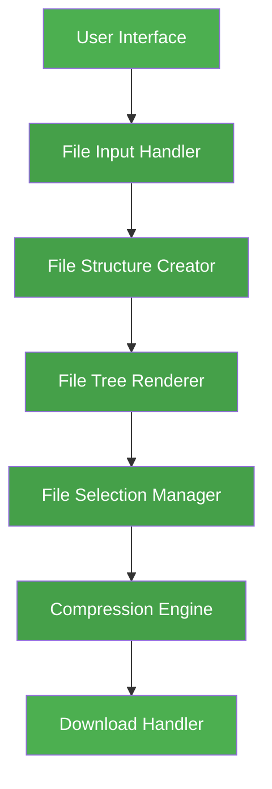

# Smart Compressor 🗜️

A modern, web-based file compression tool with a sleek interface and hacker theme option. Smart Compressor allows users to compress multiple files and folders while maintaining directory structure, with a stylish progress visualization and file type recognition.

## 🌟 Features

- 📁 Folder and multiple file compression
- 🌳 Preserves directory structure
- 🎯 Selective file compression
- 💻 Hacker theme toggle
- 📊 Real-time compression progress
- 🎨 File type recognition with custom icons
- ⚡ Client-side compression
- 🔥 Glitch effect animations

## 🚀 Live Demo

[Add your live demo link here]

## 🛠️ Architecture



## 🔧 Technologies Used

- HTML5
  - Semantic markup
  - File API integration
  - Web Storage API
- CSS3
  - Custom properties (variables)
  - Flexbox layout
  - CSS animations
  - Theme switching
- JavaScript (ES6+)
  - Async/await
  - File handling
  - DOM manipulation
  - Event handling
- JSZip Library (v3.7.1)
  - File compression
  - Directory structure preservation
  - Progress tracking

## 📥 Installation

1. Clone the repository:
```bash
git clone https://github.com/Gitesh08/smart-compressor.git
```

2. Navigate to the project directory:
```bash
cd smart-compressor
```

3. No build process is required as this is a vanilla JavaScript project. You can either:
   - Open `index.html` directly in your browser
   - Use a local development server:
     ```bash
     # Using Python 3
     python -m http.server 8000
     
     # Using Node.js's http-server
     npx http-server
     ```

## 💻 Usage

1. Click the "Upload Folder" button to select a folder for compression
2. The file tree will display with the following features:
   - Checkboxes for individual file selection
   - Expandable/collapsible folders
   - File type icons
   - File/folder hierarchy
3. Use the control buttons to:
   - Select all files
   - Deselect all files
   - Toggle theme
4. Click "Compress Selected Files" to begin compression
5. Monitor progress through the animated progress bar
6. The compressed file will automatically download as 'compressed_files.zip'

## 🎨 Themes

### Light Theme (Default)
- Clean, professional interface
- White background
- Green accent colors
- Standard file icons

### Hacker Theme
- Matrix-inspired dark interface
- Terminal-like appearance
- Green-on-black color scheme
- Text-based file icons
- Glitch animations on hover

## 📁 File Type Support

### Images
- 🖼️ jpg, jpeg, png, gif, bmp, svg, webp, ico
- Optimized for web viewing
- Preview capability (future feature)

### Documents
- 📝 doc, docx, txt, rtf, md, markdown
- 📕 pdf files
- 📊 xls, xlsx, csv (spreadsheets)
- 📊 ppt, pptx (presentations)

### Development Files
- 👨‍💻 js, jsx, ts, tsx (JavaScript/TypeScript)
- 👨‍💻 html, css, scss (Web)
- 👨‍💻 py, java, cpp, c, cs, go, rb, swift, kt (Programming)

### Media Files
- 🎵 mp3, wav, ogg, m4a, flac, aac (Audio)
- 🎥 mp4, avi, mkv, mov, wmv, flv, webm (Video)

### Other Types
- 🗄️ zip, rar, 7z, tar, gz, bz2 (Archives)
- 🔤 ttf, otf, woff, woff2, eot (Fonts)
- 🗃️ sql, db, sqlite, mdb (Databases)
- ⚙️ exe, msi, app, dmg (Executables)

## ⚙️ Technical Implementation

### File Structure Creation
```javascript
function createFileStructure(files) {
    const structure = {};
    files.forEach(file => {
        const parts = file.webkitRelativePath.split('/');
        let current = structure;
        // ... structure creation logic
    });
    return structure;
}
```

### UI Rendering
- Dynamic DOM manipulation
- Event delegation for performance
- Recursive rendering for nested structures
- Real-time updates

### Compression Engine
- Asynchronous processing
- Progress tracking
- Memory efficient
- Error handling

### Theme Management
- CSS custom properties
- Dynamic class toggling
- Local storage persistence
- Smooth transitions

## 🤝 Contributing

1. Fork the repository
2. Create your feature branch:
```bash
git checkout -b feature/AmazingFeature
```
3. Commit your changes:
```bash
git commit -m 'Add some AmazingFeature'
```
4. Push to the branch:
```bash
git push origin feature/AmazingFeature
```
5. Open a Pull Request

### Contribution Guidelines
- Follow existing code style
- Add comments for complex logic
- Update documentation
- Test thoroughly
- Create focused, single-purpose commits

## 📝 License

This project is licensed under the MIT License - see the [LICENSE.md](LICENSE.md) file for details.

## 👏 Acknowledgments

- [JSZip](https://stuk.github.io/jszip/) for compression functionality
- Unicode Standard for emoji icons
- Open source community for inspiration
- Contributors and testers

## 🔄 Version History

### 1.0.0 (Current)
- Initial Release
- Core compression functionality
- Theme toggle implementation
- File type recognition
- Progress tracking
- Directory structure preservation

### Planned Features
- Compression options (level, method)
- File preview capability
- Drag and drop interface
- Multiple theme options
- Enhanced error handling

## 📫 Contact

Developer Name - [Gitesh Mahadik](https://www.linkedin.com/in/gitesh-mahadik-7487961a0/)

Project Link: [https://github.com/Gitesh08/smart-compressor](https://github.com/yourusername/smart-compressor)

## 🐛 Bug Reports

Please report bugs through the GitHub issues page:
[https://github.com/Gitesh08/smart-compressor/issues](https://github.com/yourusername/smart-compressor/issues)

Include:
- Browser and version
- Steps to reproduce
- Expected vs actual behavior
- Screenshots if applicable

---

Made with ❤️ by [Your Name]
